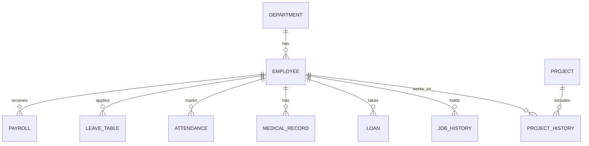

# Relational HRMS (RHRMS)

**Project Code:** RHRMS_IF3K2026
**Course:** Database Management System
**Programme:** Diploma in Information Technology (IF), 3rd Semester, K-Scheme (MSBTE)
**Institute:** Government Polytechnic, Jalgaon
**Academic Year:** 2026-27

---

## About the Project

RHRMS (Relational Human Resource Management System) is a database project built with **Oracle SQL and PL/SQL**. It stores and manages the core HR data of an organization: departments, employees, payroll, attendance, leave, medical records, loans, job history and projects.

The project demonstrates table design, primary and foreign keys, constraints, sequences, sample data and stored procedures.

**Tech stack:** Oracle SQL, PL/SQL

---

## Files in this Repository

| File | Purpose |
|---|---|
| `struct.sql` | Creates all 10 tables and their constraints |
| `insertdata.sql` | Creates the sequences and inserts the sample data |
| `employee_procedure.sql` | Procedures for search, register, update, delete and contact list |
| `mark_attendance.sql` | Procedures to mark attendance (present / absent) |
| `payroll_procedure.sql` | Procedure to generate payroll for all employees |

---

## Database Tables

| # | Table | Purpose |
|---|---|---|
| 1 | `department` | Department details |
| 2 | `employee` | Employee personal and job details |
| 3 | `payroll` | Salary, tax and net salary of employees |
| 4 | `leave_table` | Leave requests and their status |
| 5 | `attendance` | Daily attendance records |
| 6 | `medical_record` | Employee medical records |
| 7 | `loan` | Employee loan records |
| 8 | `job_history` | Job titles held by employees |
| 9 | `project` | Project details |
| 10 | `project_history` | Which employee worked on which project |

### ER Diagram



---

## Constraints Used

- **PRIMARY KEY** on the ID column of every table
- **FOREIGN KEY** for every relationship (for example `employee.dept_id` references `department`)
- **NOT NULL** on `emp_name`, `dept_name` and `project_name`
- **UNIQUE (emp_id, att_date)** on `attendance`, so an employee cannot be marked twice on the same date

---

## Sequences

Every primary key is generated by a sequence:

`seqid_dept`, `seqid_emp` (starts at 101), `seqid_payroll`, `seqid_project`, `seqid_history`, `seqid_leave`, `seqid_att`, `seqid_medical`, `seqid_loan`, `seqid_job`

---

## Stored Procedures

| Procedure | What it does | How to run |
|---|---|---|
| `search_emp` | Shows the details of one employee | `EXEC search_emp(101);` |
| `add_emp` | Registers a new employee (join date = today) | `EXEC add_emp('Name','9876543210','mail@orbit.com','Address',1);` |
| `update_emp` | Updates contact, email and address of an employee | `EXEC update_emp(101,'9999999999','new@orbit.com','New address');` |
| `delete_emp` | Deletes an employee | `EXEC delete_emp(121);` |
| `contact_list` | Prints the contact directory of all employees | `EXEC contact_list;` |
| `sp_attendance` | Marks **all employees Present** for today's date | `EXEC sp_attendance;` |
| `sp_mark_absent` | Changes one attendance record to Absent | `EXEC sp_mark_absent(5);` |
| `sp_payroll` | Inserts a payroll record for every employee | `EXEC sp_payroll;` |

---

## Sample Data

- 4 departments: Information Technology, Finance, Human Resources, Administration
- 20 employees (5 per department)
- 1 project, with the 5 IT employees assigned to it
- Leave, medical, loan and job history records for the employees

Attendance and payroll rows are created by running `sp_attendance` and `sp_payroll`.

---

## How to Run

Run the files in this order in Oracle SQL*Plus, SQL Developer or Live SQL:

```sql
@struct.sql
@insertdata.sql
@employee_procedure.sql
@mark_attendance.sql
@payroll_procedure.sql
```

Then try:

```sql
SET SERVEROUTPUT ON;

EXEC sp_attendance;
EXEC sp_mark_absent(1);
EXEC sp_payroll;

SELECT * FROM attendance ORDER BY att_id;
SELECT * FROM payroll ORDER BY payroll_id;
```

### Notes

- Running `sp_attendance` twice on the same day gives `ORA-00001` (unique constraint), which prevents duplicate attendance.
- Running `sp_payroll` twice adds a second payroll record for every employee.
- `delete_emp` will not delete the sample employees, because they have related records in other tables. To test it, register a new employee with `add_emp` and delete that one.
- The leave table is named `leave_table` because `LEAVE` is a reserved word in Oracle.

---

## Normalization

All tables have atomic values (1NF), use single-column primary keys so there is no partial dependency (2NF), and have no transitive dependencies (3NF), with one exception: `payroll.net_salary`. This is a derived column (`salary - tax`) that is stored for convenience and filled by `sp_payroll`.

---

## Author

Student, Diploma in Information Technology (3rd Semester, K-Scheme)
Government Polytechnic, Jalgaon
